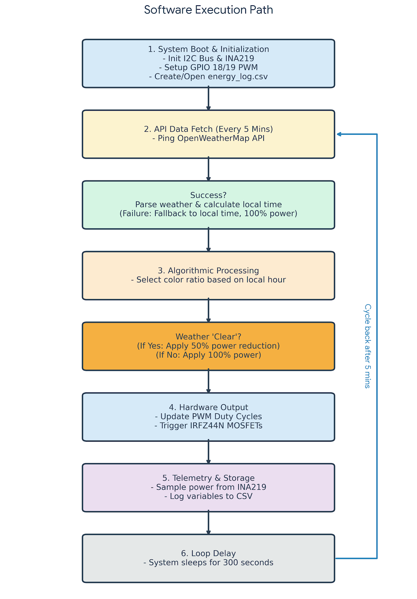
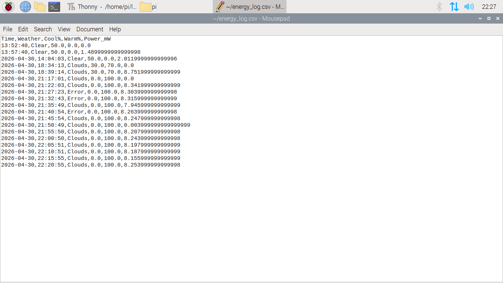

# 🌞 API-Driven Human-Centric Lighting Controller

## 📖 1. Project Abstract & Objectives
This repository contains the documentation, architecture, and logic for an advanced API-driven lighting controller engineered for automated, human-centric environments[cite: 1]. 

The primary objective of this project is to synthesize digital geospatial data and physical actuation into a cohesive, automated Cyber-Physical System (CPS)[cite: 1]. Commercial smart-lighting solutions frequently depend on proprietary, closed-loop ecosystems that lack interoperability, making it difficult to bridge external digital data streams with custom physical hardware[cite: 1]. This project addresses those limitations by validating the efficacy, thermal safety, and network resilience of using local edge-compute devices to drive complex biological lighting models[cite: 1]. 

## 🧬 2. Core Concepts

### Human-Centric Lighting (HCL) & Circadian Rhythms
Modern commercial environments predominantly rely on static lighting systems or rudimentary, timer-based dimming arrays that fail to accurately reflect real-time solar conditions[cite: 1]. This system is fundamentally grounded in the biological concept of the human circadian rhythm—a 24-hour internal clock regulated by environmental light cues interacting with non-image-forming photoreceptors in the human eye[cite: 1].

Natural daylight undergoes continuous, imperceptible spectral shifts[cite: 1]:
*   **Dawn:** Warmer hues[cite: 1].
*   **Solar Noon:** Peaks at cooler, blue-enriched light[cite: 1].
*   **Dusk:** Returns to warm tones[cite: 1].

By accurately replicating this dynamic solar spectrum indoors, the system dictates the secretion of critical hormones (such as cortisol for daytime alertness and melatonin for sleep regulation), thereby optimizing occupant cognitive performance and physiological well-being[cite: 1].

### Daylight Harvesting
This architecture establishes the logic groundwork for an advanced energy-management strategy known as *daylight harvesting*[cite: 1]. This strategy utilizes available natural sunlight to offset artificial lighting[cite: 1]. By synchronizing the artificial light's color temperature with the external sun, any supplementary indoor lighting blends perfectly with natural daylight, maintaining targeted lux levels while drastically optimizing energy consumption[cite: 1].

---

## 🛠️ 3. System Architecture & Hardware Setup

The system operates as an edge-computed Cyber-Physical System utilizing the following hardware components:
*   **Logic Controller:** Raspberry Pi 4 edge-compute node[cite: 1].
*   **Actuation / Switching:** IRFZ44N MOSFETs (Triggered via high-frequency PWM signals on GPIO pins 18 and 19)[cite: 1].
*   **Illumination Matrix:** A discrete, dual-channel matrix consisting of independent warm-white and cool-white Light Emitting Diodes (LEDs)[cite: 1].
*   **Power Telemetry:** INA219 Sensor (interfaced via I2C Bus) to measure real-time milliwatt (mW) consumption.

---

## 💻 4. Software Architecture & Execution Path (Continuous Loop)

The system is driven by a custom Python-based continuous loop algorithm that executes seamless linear interpolation of the dual PWM channels, ensuring physiological comfort through smooth lighting transitions rather than jarring, hard-switched presets[cite: 1]. 

**Software Execution Path:**

As detailed in the flowchart above, the loop runs in a 300-second (5-minute) cycle:
1.  **System Boot & Initialization:** Initializes the I2C Bus, INA219 power sensor, sets up GPIO pins 18/19 for PWM, and creates/opens the telemetry file.
2.  **API Data Fetch:** Pings the OpenWeatherMap API every 5 minutes to fetch real-time geographic and solar milestones[cite: 1].
3.  **Algorithmic Processing:** Selects the target color ratio (warm vs. cool PWM duty cycle) based strictly on the local hour to simulate natural daylight progressions[cite: 1].
4.  **Weather Adaptation (Daylight Harvesting):** Evaluates weather. If 'Clear', applies a 50% power reduction to harvest available natural daylight. Otherwise, applies 100% power.
5.  **Hardware Output:** Updates specific PWM duty cycles and triggers the IRFZ44N MOSFETs to physically adjust the LED matrix.
6.  **Telemetry & Storage:** Samples real-time power consumption and logs variables to a CSV file.
7.  **Loop Delay:** The system sleeps for 300 seconds before cycling back to Step 2.

---

## 📊 5. Telemetry Validation & Data Logging

The system records its operational states locally to validate energy efficiency and logic execution. The output logs confirm the "Daylight Harvesting" logic successfully intercepts clear weather conditions to reduce power loads.

**Telemetry Output Log:**

*Observation highlights from the log above:*
*   **Clear Mid-Day (13:57:40):** Cool light is active, but power is drastically reduced (~1.5 mW) due to the 50% daylight harvesting reduction.
*   **Cloudy Evening (18:39:14):** Evening approaches (shifting to 70% warm). Clouds block the sun, so the system outputs 100% required power (~8.7 mW).
*   **API Failsafe (21:27:23):** When the API triggers an error, the system defaults to local time (100% warm for night) and outputs 100% failsafe power (~8.3 mW).